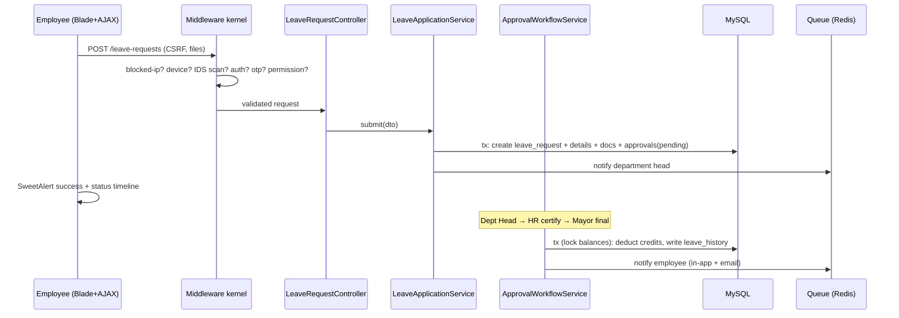

# Architecture

**Phase 2 deliverable.** See DecisionLog.md / `docs/adr/` for the reasoning behind each choice.

## 1. Style

A **layered monolith** on Laravel 12 (MVC + Service layer + Repository pattern), deployed on a
single LAN server (Apache/XAMPP). A monolith was chosen over microservices deliberately
(ADR-001): one LGU server, one ops team, offline LAN — operational simplicity wins.

```
┌────────────────────────────────────────────────────────────┐
│  Presentation                                              │
│  Blade views · Bootstrap 5 · Chart.js · SweetAlert2 · AJAX │
├────────────────────────────────────────────────────────────┤
│  HTTP layer                                                │
│  Routes (web / api v1) · Controllers · Form Requests       │
│  Middleware pipeline (security kernel — see §3)            │
├────────────────────────────────────────────────────────────┤
│  Domain / Application layer                                │
│  Services (LeaveApplicationService, LeaveCreditService,    │
│  ApprovalWorkflowService, OtpService, LoginSecurityService,│
│  IntrusionDetectionService, AuditLogger, ReportService,    │
│  DeviceService, DashboardService, BackupService)           │
├────────────────────────────────────────────────────────────┤
│  Data access                                               │
│  Repositories (interface-bound, DI) · Eloquent models      │
├────────────────────────────────────────────────────────────┤
│  Infrastructure                                            │
│  MySQL · Redis (cache/queue) · Mail (SMTP) · Storage       │
│  Queue workers · Scheduler (accrual, expiries, cleanup)    │
└────────────────────────────────────────────────────────────┘
```

## 2. Key modules

| Module | Namespace | Responsibility |
|--------|-----------|----------------|
| Auth | `App\Http\Controllers\Auth`, `App\Services\Auth` | login, OTP, lockout, password reset, device check |
| RBAC | `App\Services\Rbac`, `App\Http\Middleware\PermissionMiddleware` | dynamic permissions, inheritance, menu gates |
| Leave | `App\Services\Leave` | CSC Form 6, credits, validation, workflow |
| Security | `App\Services\Security` | IDS, IP blocking, audit, activity log |
| Admin | `App\Http\Controllers\Admin` | users, devices, roles, settings, security dashboard |
| Reports | `App\Services\Reports`, exports in `App\Exports` | 9 reports × PDF/XLSX/CSV |
| API | `App\Http\Controllers\Api\V1` | versioned REST + OpenAPI |

## 3. Security kernel (middleware pipeline, request order)

1. `TrustProxies` / `HTTPS redirect` (production)
2. `BlockedIpMiddleware` – rejects blocked IPs before any work (DoS containment)
3. `AuthorizedDeviceMiddleware` – LAN device allow-list (toggleable)
4. `IntrusionDetectionMiddleware` – signature scan (SQLi/XSS/traversal) of URI+input, rate anomaly detection, auto-block escalation
5. Laravel session/CSRF stack (`VerifyCsrfToken` failures are converted into intrusion events)
6. `auth` + `otp.verified` – session is only "authenticated" after OTP
7. `permission:<name>` – dynamic RBAC gate
8. `ActivityLogMiddleware` – page-level activity trail
9. `SecurityHeaders` – CSP, X-Frame-Options, nosniff, Referrer-Policy, HSTS

## 4. Request flow – leave application (happy path)



## 5. Scheduled jobs

| Job | Schedule | Purpose |
|-----|----------|---------|
| `leave:accrue` | monthly (1st, 00:05) | +1.25 VL / +1.25 SL per active employee (idempotent per month) |
| `security:unblock-expired` | every 5 min | lift expired IP/account blocks |
| `otp:prune` | hourly | delete expired OTP codes |
| `devices:mark-offline` | every 5 min | device online/offline from last_seen |
| `backup:run` | daily 01:00 | DB + storage backup |

## 6. Data flow & trust boundaries

Trust boundary 1: browser ⇄ Apache (TLS). Trust boundary 2: app ⇄ MySQL/Redis (localhost only).
All input crosses boundary 1 untrusted and passes Form Request validation + IDS scan;
all output is Blade-escaped. See ThreatModel.md.

## 7. Frontend architecture

Server-rendered Blade with a shared `layouts.app` shell (sidebar driven by permission-filtered
menu config), progressive AJAX for dashboards (Chart.js JSON endpoints), SweetAlert2 for
confirmations/toasts, skeleton loaders on charts/tables, CSS-variable-based dark/light theme
persisted in `localStorage`. **No CDN calls** — all assets served from `public/vendor` (NFR-1).

## 8. Diagrams

Context diagram, DFD-0/1, use case, class, activity, deployment and network diagrams are in
`docs/Diagrams.md` (Mermaid sources, render on GitHub).
