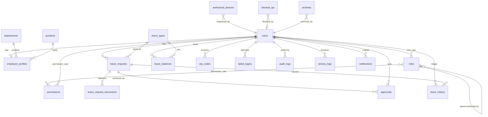

# Database Design (Phase 3)

Engine: **MySQL 8 / MariaDB 10.6+ (utf8mb4, InnoDB)**. Development and CI run on SQLite; all
migrations are engine-portable. Normalized to 3NF; denormalization only where audit trails
require frozen copies of values (e.g., salary on a filed leave form).

## Tables (25)

| Table | Purpose / notable columns |
|-------|---------------------------|
| `users` | login identity: name, username (unique), email (unique), password (bcrypt), status (`active/inactive/blocked`), blocked_until, blocked_reason, must_change_password, last_login_at/ip, remember_token, soft deletes |
| `roles` | name, slug, description, `parent_id` (self-FK → role inheritance), is_system |
| `permissions` | name, slug (e.g. `leave.approve.final`), module, description |
| `permission_role` | pivot role↔permission |
| `role_user` | pivot user↔role |
| `permission_user` | direct user grants (allow/deny override) |
| `departments` | name, code, head_user_id FK, soft deletes |
| `positions` | title, salary_grade, department scoping optional |
| `employee_profiles` | user_id FK unique, employee_no unique, names, gender, civil_status, birth_date, contact_no, address (residence for calamity validation), salary (decimal 12,2), department_id, position_id, employment_status, date_hired, signature_path |
| `leave_types` | code (VL/SL/ML…), name, category, max_days, deductible (bool), credit_source (`vacation/sick/none`), requires_medical_after_days, filing_deadline_days, detail_schema (JSON — dynamic detail fields), required_documents (JSON rules), approval_flow (JSON step list), annual_reset (bool), expires (bool), is_custom, active |
| `leave_requests` | reference_no unique, user_id, leave_type_id, date_filed, start_date, end_date, working_days (decimal 4,1), details (JSON – details-of-leave), purpose, commutation (bool), status enum (`draft,pending,dept_review,hr_review,final_review,approved,rejected,returned,cancelled`), current_step, late_filing_reason, is_late_filing, days_with_pay/without_pay, disapproval_reason, applicant_signature snapshot fields (office, position, salary frozen), soft deletes |
| `leave_request_documents` | leave_request_id, type (medical_certificate, solo_parent_id, …), original name, path, hash (sha256), size, uploaded_by |
| `approvals` | leave_request_id, step_no, role_slug (`department_head/hr/mayor`), approver_id, action (`approved,rejected,returned,certified`), comments, days_with_pay/without_pay, certified balances JSON (HR step), signature snapshot, acted_at |
| `leave_balances` | user_id + leave_type_id unique, earned (decimal 7,3), used, balance, last_accrued_period. VL/SL accrue 1.25/month; CHECK/application-guard: balance ≥ 0 |
| `leave_history` | append-only ledger: user_id, leave_type_id, leave_request_id nullable, entry_type (`accrual,deduction,adjustment,monetization,reversal`), days (+/−), balance_after, remarks, actor_id |
| `holidays` | date, name, scope — working-day computation |
| `otp_codes` | user_id, code_hash, purpose (`login,password_reset,sensitive_action`), expires_at, consumed_at, attempts, ip |
| `failed_logins` | identifier attempted, user_id nullable, ip, user_agent, reason, occurred_at |
| `blocked_ips` | ip unique, reason, source (`auto,manual`), blocked_by nullable, expires_at nullable, active |
| `authorized_devices` | ip_address, hostname, mac nullable, description, status (`active,inactive`), registered_by, last_active_at, archived_at (soft archive) |
| `intrusion_logs` | category (`sqli,xss,traversal,csrf,rate,auth_fail,device,privilege,other`), severity (`low,medium,high,critical`), route, method, payload_excerpt (truncated+sanitized), matched_rule, ip, user_agent, user_id nullable, handled (bool) |
| `audit_logs` | user_id nullable, role snapshot, action, auditable_type/id (morph), old_values JSON, new_values JSON, ip, user_agent, url — **append-only** |
| `activity_logs` | user_id, method, path, route_name, ip, user_agent — page trail |
| `notifications` | Laravel notifications table (uuid, morph, data JSON, read_at) |
| `system_settings` | key unique, value, type (`int,bool,string,json`), group, description |
| `archives` | morph record of archived entities (type, record_id, snapshot JSON, archived_by, restored_at) |
| `password_reset_tokens` | Laravel default (email, token, created_at) |
| `sessions` | Laravel database session driver (enables session listing/expiry control) |
| plus framework tables: `cache`, `jobs`, `job_batches`, `failed_jobs`, `personal_access_tokens` |

## ERD (Mermaid)

## Integrity & indexing

- FKs with `restrict` on masters (leave_types, departments) and `cascade` only on children of a request (documents, approvals).
- Indexes: `leave_requests(user_id,status)`, `(leave_type_id,start_date)`, `intrusion_logs(created_at,severity)`, `failed_logins(ip,occurred_at)`, `audit_logs(auditable_type,auditable_id)`, `activity_logs(user_id,created_at)`, `authorized_devices(ip_address)`, `blocked_ips(ip,active)`.
- Balance updates run inside `DB::transaction` with `lockForUpdate()` on the balance rows; the service refuses to commit a negative balance (FR-L6).
- `leave_history` and `audit_logs` have no update/delete code paths (repudiation control).

## Credit accrual model

CSC: full-time employees earn **1.25 VL + 1.25 SL per month** of service. `leave:accrue`
writes one `accrual` ledger row per user/type/period (unique period guard ⇒ idempotent) and
increments `leave_balances.earned/balance`. Mandatory/Forced leave (5 days) deducts from VL
credits and is tracked per year from approved forced-leave requests.
