# System Diagrams

All diagrams are Mermaid (render on GitHub / VS Code). The ERD is in `Database.md`.

## 1. Context Diagram (Level -0)

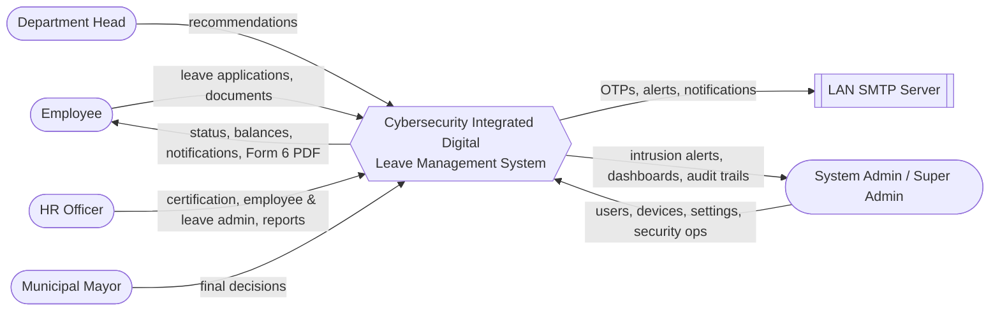

## 2. DFD Level 0

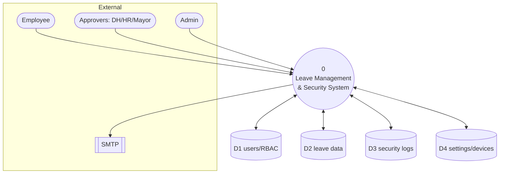

## 3. DFD Level 1

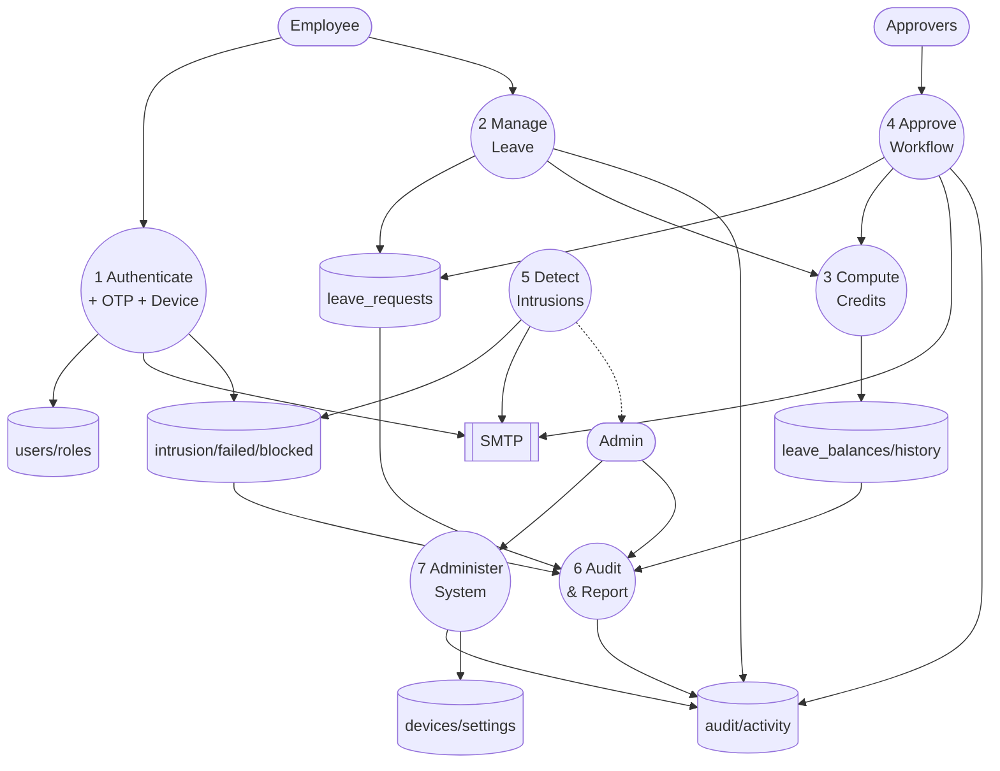

## 4. Use Case Diagram

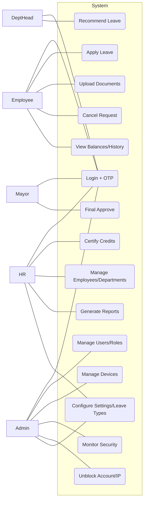

## 5. Class Diagram (domain core)

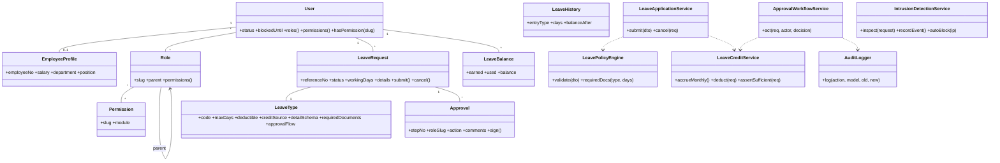

## 6. Activity Diagram — leave approval workflow

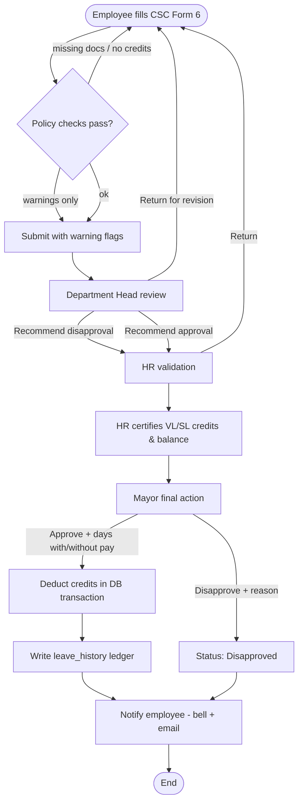

## 7. Sequence Diagram — login with OTP, lockout & IDS

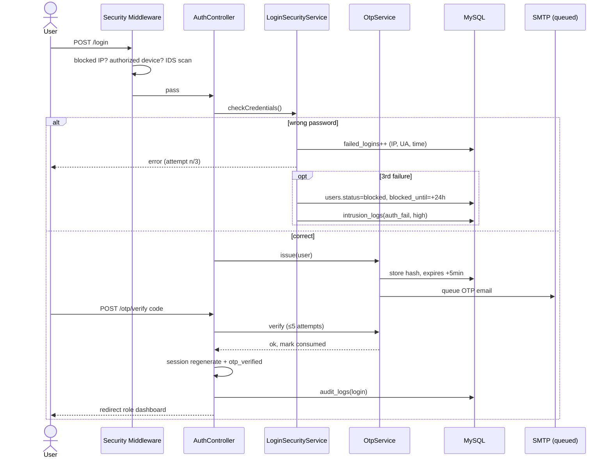

## 8. Deployment Diagram

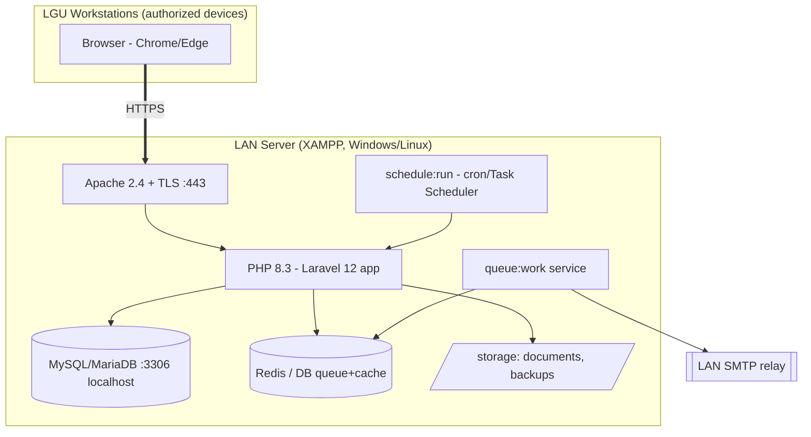

## 9. Network Diagram

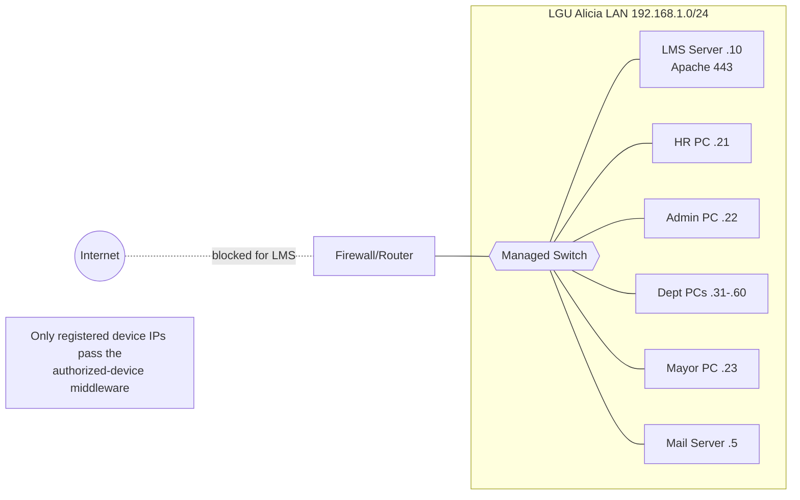

## 10. Flowchart — automatic account lockout

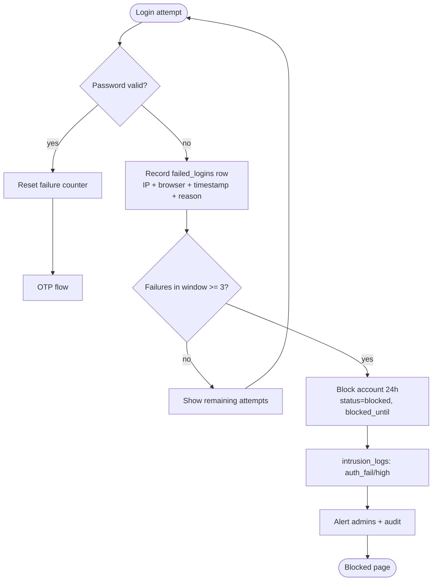

## 11. Flowchart — intrusion detection & auto IP block

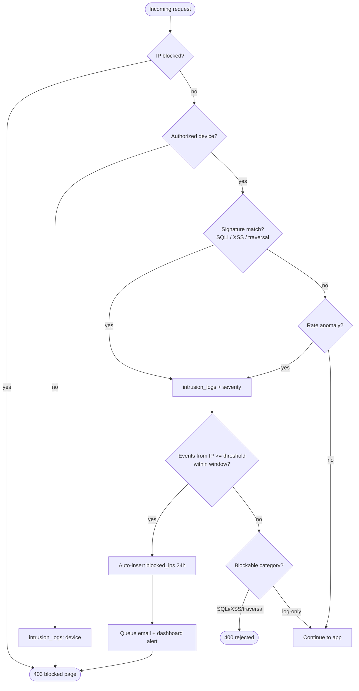
